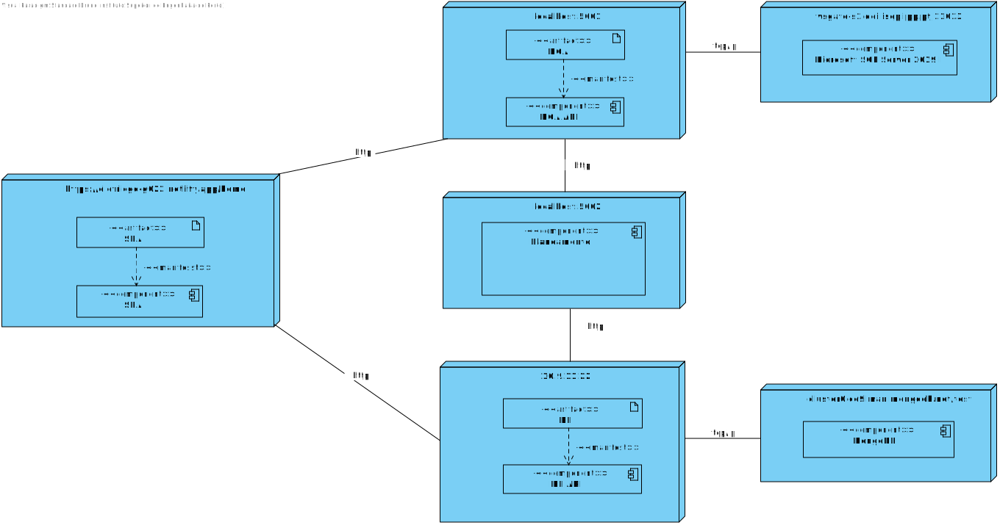

# Mapping between Views

## Nível 1
### Vista Lógica - Vista de Implementação

n/a

### Vista de Implementação - Vista Física

n/a

## Nível 2
### Vista Lógica - Vista de Implementação 

### Vista de Implementação - Vista Física

## Nível 3
### Vista Lógica - Vista de Implementação (SPA)
