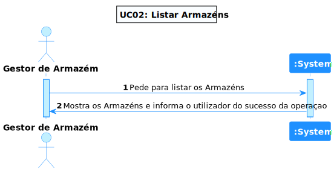
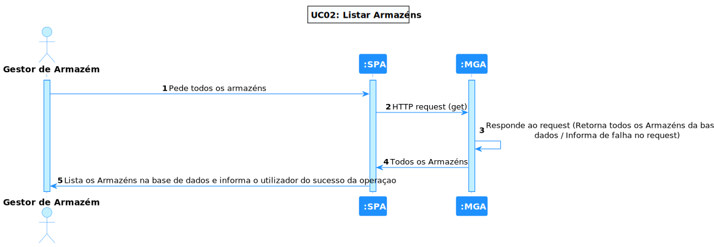
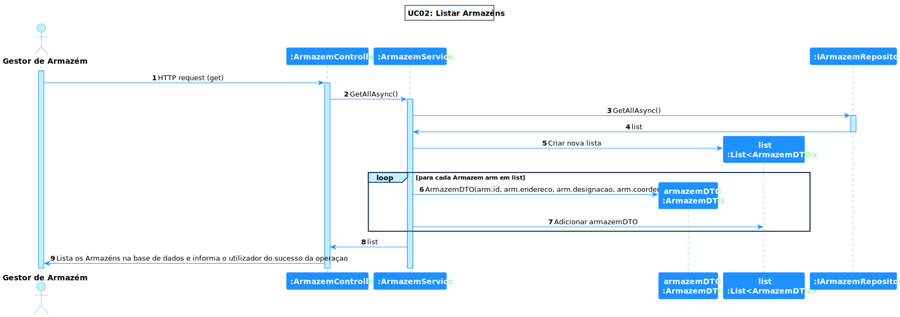

# UC 02 - Listar Armazéns

## **1. Requirements Engineering**

### **1.1. Descrição da Use Case**

*Listar Armazéns*

### **1.2. Clarificações e especificações do cliente**

* Pergunta: "Porque atributos gostaria que a filtragem dos armazéns fosse feita?"
* [Resposta:](https://moodle.isep.ipp.pt/mod/forum/discuss.php?d=18958#p24139) "Pelo seu identificador e designação."

### **1.4. Dependências**

*Existe uma dependência com a UC01, pois é necessário criar Armazéns para os poder listar.*

### **1.5 Input e Output**

**Output Data**

* lista dos armazéns

---

## **2. Vista de Processos**

### **2.1. Nível 1**

### **2.2. Nível 2**

### **2.3. Nível 3**

---

## **3. Observations**

### **3.1 Desenvolvimento**

**Dificuldades:** Apesar de este UC ser fácil após obter o conhecimento necessário para a desenvolver, house uma dificuldade no que se toca a obter esse conhecimento durante o desenvolvimento, obrigando a retirar e gastar tempo resolvendo erros, pequisando sobre possiveis soluções, etc. Desta maneira, certos requisitos mais pequenos foram, ás vezes, descartados, devido a não saber como a concretizar e naão ter o tempo necessário para descobrir, testar, falhar e re-iterar.

**Concretização:** Este UC ficou quase completamente concretizado, adicionando e tendo atenção ao detalhe na sua maior parte, mas falhando em concretizar certos aspetos, tais como:

* A filtragem dos Armazéns pelo seu identificador e designação.

### **3.2 Testes**

Foram realizados diversos testes sobre os objectos relativos a esta UC, tais como:

**Id**: 
* Verificação sobre as limitações impostas (3 caracteres alfanumericos).

**Endereço**: 
* Verificação sobre as limitações impostas (codigo postal deve ter 8 caracteres: 7 dígitos (4+3) separados por um hífen (-) e sem espaços).

**Designacao**: 
* Verificação sobre as limitações impostas (máximo de 50 caracteres).

**Coordenadas**: 
* Verificação sobre as limitações impostas (latitude entre -90 e 90 e longitude entre -180 e 180).

**Armazem**: 
* Criação do Armazém;
* Metodo Equals();
* Excecoes lançadas ao tentar alterar um Armazém inativo.

**Armazem DTO**: 
* Criação do DTO.

**Armazem Mapper**: 
* Passar de Armazém para DTO;
* Passar de DTO para Armazém.

**Armazem Service**: 
* Adicionar um Armazém;
* Obter todos os Armazéns;
* Obter Armazém por Id;
* Atualizar um Armazém;
* Desativar um Armazém;

**Armazem Controller**: 
* Obter todos os Armazéns;
* Obter Armazém por Id;

