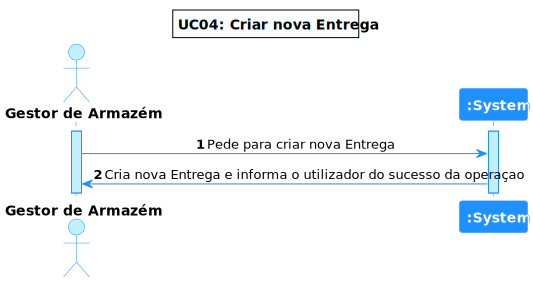
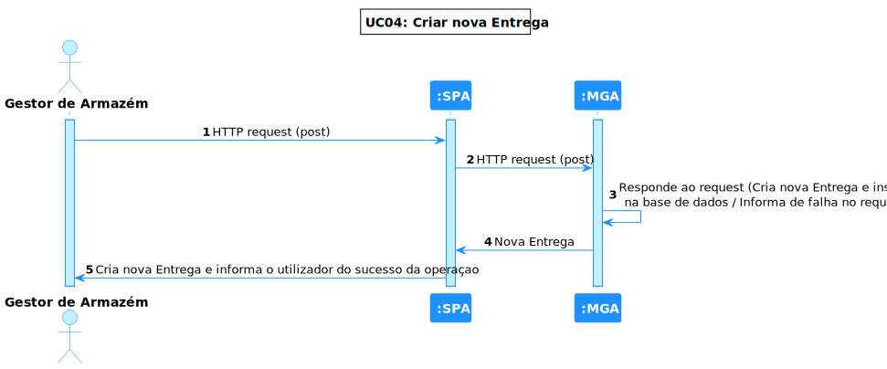
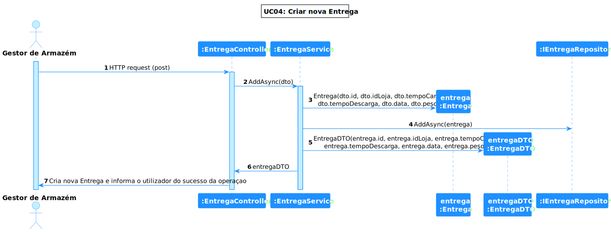

# UC 04 - Criar uma Entrega

## 1. Requirements Engineering

### 1.1. Descrição da Use Case

*Criar uma Entrega.*

### 1.2. Clarificações e especificações do cliente

* Pergunta: "O plano de entregas é o quê exatamente? É uma folha com as entregas a ser feitas nesse dia? Tem um identificador? É algo criado no próprio sistema baseado nas entregas previstas para esse dia e atribuída automaticamente? Sendo criadas no sistema, qual o processo do mesmo?"
* [Resposta:](https://moodle.isep.ipp.pt/mod/forum/discuss.php?d=18769) "o plano diário de entregas é a lista de entregas que terão que ser feitas num dado dia nos vários armazéns. podme ver exemplos no ficheiro excel disponibilizado. No sistema completo esse plano seria gerado por um módulo sepaardo com base nas encomendas colocadas por cada armazém. no âmbito do nosso sistema, essa infromação será introduzida pelo utilizador"

* Pergunta: "Caro cliente, Como deverá ser o identificador de uma entrega? Deve ser introduzido pelo utilizador ou gerado? Deve seguir um padrão especifico? Qual é o seu formato?"
* [Resposta:](https://moodle.isep.ipp.pt/mod/forum/discuss.php?d=18802) "o identificador de entrega é gerado automaticamente pelo sistema e não tem qualquer tipo de formato ou semantica"

### 1.4. Dependências

*Não existem dependências.*

### 1.5 Input e Output

Input Data
  	
* Id da Loja
* Tempo de Carga da Entrega
* Tempo de Descarga da Entrega
* Dia da Entrega
* Mês da Entrega
* Ano da Entrega
* Peso da Entrega

Output Data

* A entrega criada

## 2. Vista de Processos

### 2.1. Nível 1

### 2.2. Nível 2

### 2.3. Nível 3

# 3. Observations

*O início do desenvolvimento desta UC foi complicado pelos poucos conhecimentos de .NET, à medida que o tempo foi andando e com a obtenção de mais conhecimentos foi-se tornando mais evidente e fácil a sua execução.*

