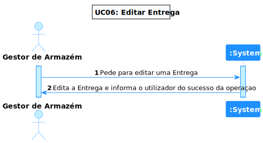
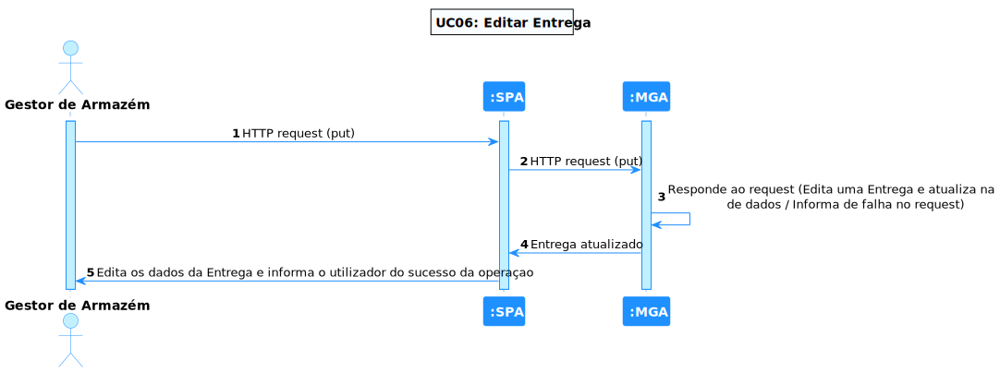
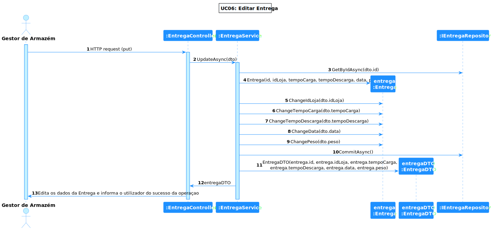

# UC 06 - Editar uma Entrega

## 1. Requirements Engineering

### 1.1. Descrição da Use Case

*Editar uma Entrega.*

### 1.2. Clarificações e especificações do cliente

* Pergunta: "Caro cliente, No caso das entregas, pretende conseguir editar a informação de uma forma parcial (PATCH) ou de uma forma total (PUT)?"
* [Resposta:](https://moodle.isep.ipp.pt/mod/forum/discuss.php?d=18878) "funcionalmente é necessário ter atenção a quais os dados que podem ser alterados ou não. por exemplo, não se pode alterar o identificador da entrega. No entanto o utilizador deve ser livre de escolher qua o subconjunto de dados que pretende alterar"

### 1.4. Dependências

*Haver Entregas já no sistema.*

### 1.5 Input e Output

Input Data
  	
* Id da Loja
* Tempo de Carga da Entrega
* Tempo de Descarga da Entrega
* Dia da Entrega
* Mês da Entrega
* Ano da Entrega
* Peso da Entrega

Output Data

* A entrega editada

## 2. Vista de Processos

### 2.1. Nível 1

### 2.2. Nível 2

### 2.3. Nível 3

# 3. Observations

*O início do desenvolvimento desta UC foi complicado pelos poucos conhecimentos de .NET, à medida que o tempo foi andando e com a obtenção de mais conhecimentos foi-se tornando mais evidente e fácil a sua execução.*

