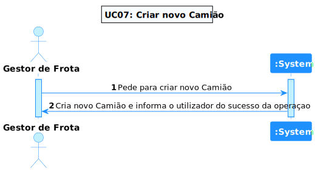
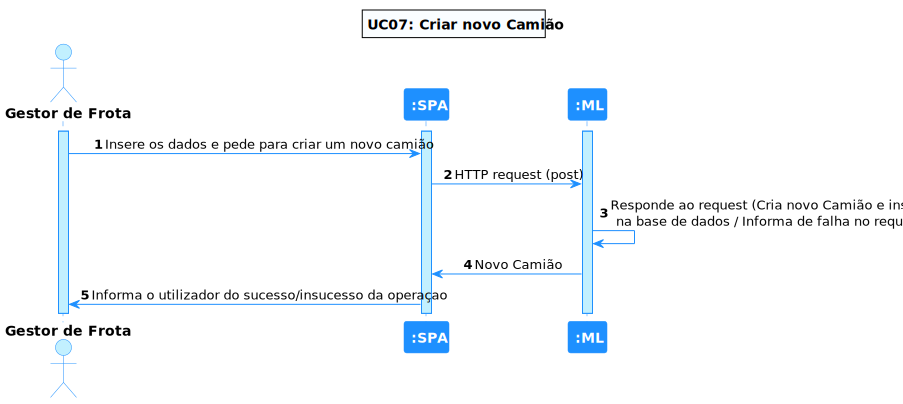
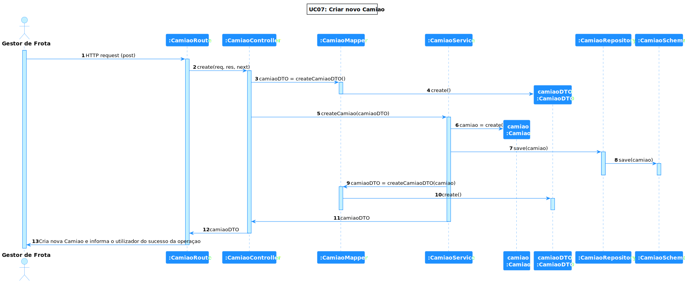

# UC 07 - Criar um camião

## 1. Requirements Engineering

### 1.1. Descrição da Use Case

*Criar um camião.*

### 1.2. Clarificações e especificações do cliente

* Pergunta: "Pretende que a matrícula do camião seja gerada automaticamente na sua criação ou inserida manualmente? Caso seja gerada automaticamente o seu formato será o português "AZ-19-AZ" ou tem de suportar os formatos dos vários países?"
* [Resposta:](https://moodle.isep.ipp.pt/mod/forum/discuss.php?d=18731#p23860) "por motivos obvios, a matricula não pode ser gerada automaticamente e terá que ser introduzida pelo utilizador. apenas existem matriculas portuguesas emitidas pelo IMT"

### 1.4. Dependências

*Não existem dependências.*

### 1.5 Input e Output

Input Data
  	
* json com os seguintes atributos:
  * matrícula
  * tara
  * capacidade de carga
  * carga da bateria
  * autonomia
  * tempo de carregamento rápido

Output Data

* O camião criado

## 2. Vista de Processos

### 2.1. Nível 1

### 2.2. Nível 2

### 2.3. Nível 3

# 3. Observations

* Este UC, foi bastante simples, a maior dificuldade refere-se ao facto de ter sido a primeira vez a trabalhar nesta linguagem, o
que levou a um pouco mais de pesquisa para a elaboração do código e testes.

