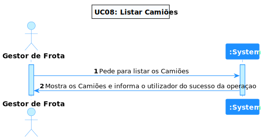
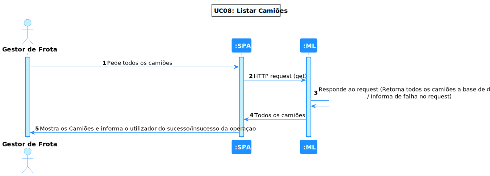
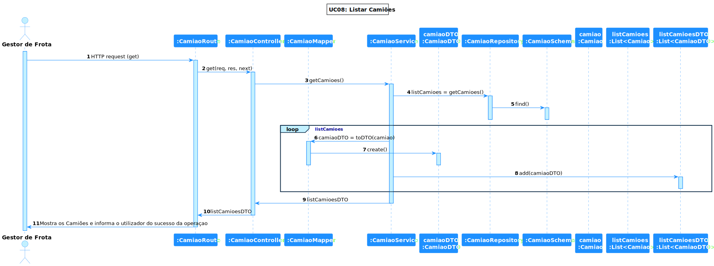

# UC 08 - Listar Camião

## 1. Requirements Engineering

### 1.1. Descrição da Use Case

*Listar Camiões*

### 1.2. Clarificações e especificações do cliente

### 1.4. Dependências

*Existe uma dependência com a UC07, pois é necessário criar camiões para listar.*

### 1.5 Input e Output

Input Data

Output Data

* lista dos camiões

## 2. Vista de Processos

### 2.1. Nível 1

### 2.2. Nível 2

### 2.3. Nível 3

# 3. Observations

* Este UC, foi bastante simples, a maior dificuldade refere-se ao facto de ter sido a primeira vez a trabalhar nesta linguagem, o
  que levou a um pouco mais de pesquisa para a elaboração do código e testes.

