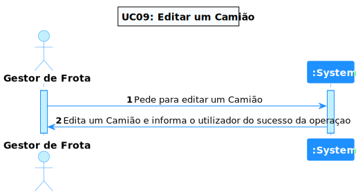
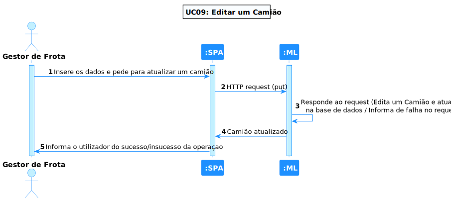
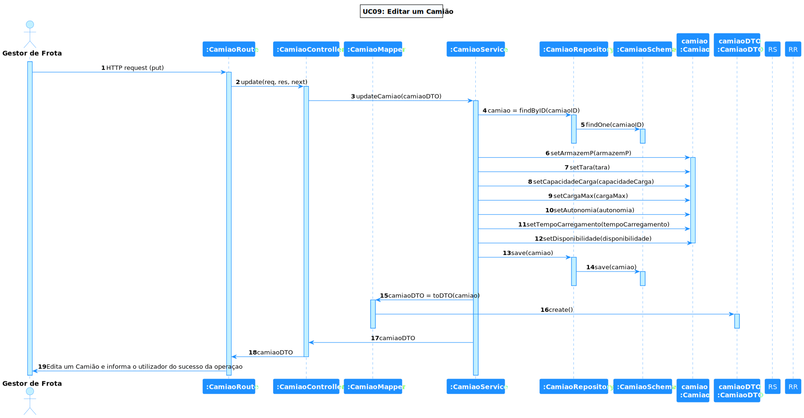

# UC 09 - Editar um camião

## 1. Requirements Engineering

### 1.1. Descrição da Use Case

*Editar um camião.*

### 1.2. Clarificações e especificações do cliente

* Pergunta: "Pretende que seja possível editar as informações de um camião todas de uma vez ou prefere primeiro indicar quais as informações que se pretende editar e só depois editar as informações?"
* [Resposta:](https://moodle.isep.ipp.pt/mod/forum/discuss.php?d=18583#p23726) "a matricula do camião não pode ser alterada em enhum cenário, os restantes atributos podem ser alterados, devendo o sistema estar preparado para poder alterar um subconjunto de atributos"

### 1.4. Dependências

*Existe dependência com a UC07, pois é necessário criar um camião para editar.*

### 1.5 Input e Output

Input Data

* json com os seguintes atributos:
    * matrícula
    * tara
    * capacidade de carga
    * carga da bateria
    * autonomia
    * tempo de carregamento rápido

Output Data

* o camião com os atributos atualizados

## 2. Vista de Processos

### 2.1. Nível 1

### 2.2. Nível 2

### 2.3. Nível 3

# 3. Observations

* Este UC, foi bastante simples, a maior dificuldade refere-se ao facto de ter sido a primeira vez a trabalhar nesta linguagem, o
que levou a um pouco mais de pesquisa para a elaboração do código e testes.

