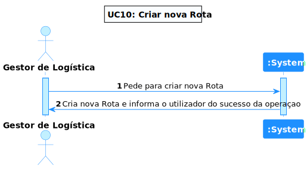
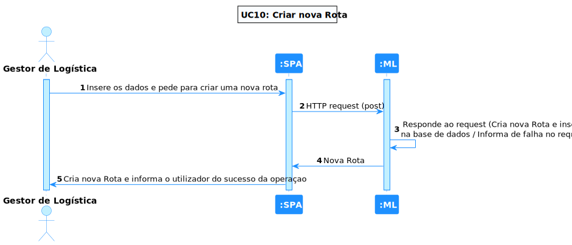
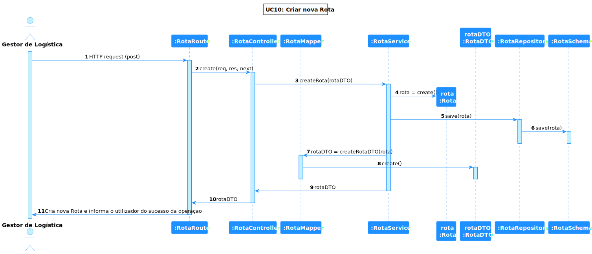

# UC 10 - Criar 'Rota'

## 1. Requirements Engineering

### 1.1. Descrição da Use Case

Criar 'Rota'.

### 1.2. Clarificações e especificações do cliente

* Pergunta: "Quanto ao UC:"Criar, Listar e Editar Percurso entre dois armazéns.", é possível existir mais do que um percurso com os mesmos identficadores de armazém de partida e chegada?"
* [Resposta:](https://moodle.isep.ipp.pt/mod/forum/discuss.php?d=18987#p24152) "Do ponto de vista do módulo de Planeamento só estamos a considerar um percurso em cada sentido entre os armazéns, assume-se que é o melhor percurso entre esses armazéns. Notar que o percurso entre o armazém A e o armazém B é diferente do percurso entre o armazém B e o A, podendo envolver distâncias, tempos e consumos energéticos diferentes ao serem percorridos."

### 1.4. Dependências

É necessário existir pelo menos 2 armazéns para ser criada uma rota.

### 1.5 Input e Output

Input Data
  	
* json com os seguintes atributos :idArmazemPartida,idArmazemChegada,distancia,tempoViagemCheio,energiaGasta,tempoCarregamentoMáximo

Output Data

* a rota criada

## 2. Vista de Processos

### 2.1. Nível 1

### 2.2. Nível 2

### 2.3. Nível 3

# 3. Observations
Esta Use Case é bastante simples de entender, porém, como o grupo não tem experiência na devida linguagem, o desenvolvimento foi mais demorado que o suposto, mas, apesar das dificuldades, foi possível concretizar a implementação e os respetivos testes.

