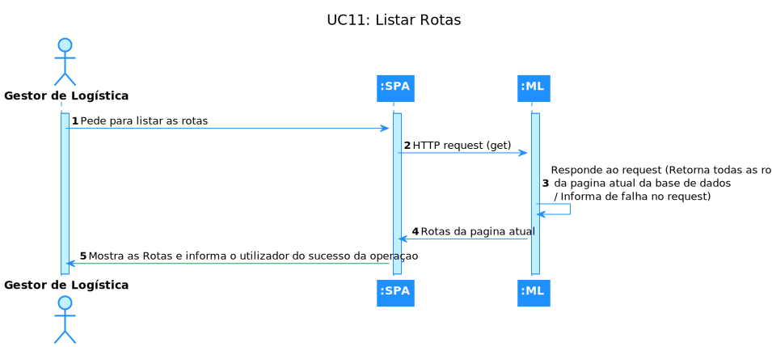
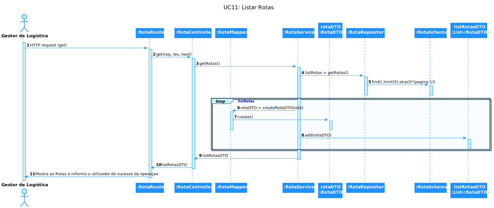

# UC 11 - Listar 'Rota'

## 1. Requirements Engineering

### 1.1. Descrição da Use Case

Listar 'Rota'.

### 1.2. Clarificações e especificações do cliente

* Pergunta: "Quanto ao UC:"Criar, Listar e Editar Percurso entre dois armazéns" o que é pretendido quanto à listagem?
Listar só um percurso, ou listar os percursos de acordo com uma determinda filtragem e ordem ?

Caso seja pretendida a segunda opção, deseja que seja ordenado e filtrado por que tipo de informação?"
* [Resposta:](https://moodle.isep.ipp.pt/mod/forum/discuss.php?d=18952#p24138) "deve ser possivel listar todos os percursos, podendo efetuar pesquisas/filtros sobr eos mesmos, nomeadamente sobre o armazem origem e/ou armazem destino."

### 1.4. Dependências

É necessário existir, pelo menos, uma rota para conseguir listar.

### 1.5 Input e Output

Output Data

* a/as rota/s

## 2. Vista de Processos

### 2.1. Nível 1

### 2.2. Nível 2

### 2.3. Nível 3

# 3. Observations
Esta Use Case é bastante simples de entender, porém, como o grupo não tem experiência na devida linguagem, o desenvolvimento foi mais demorado que o suposto, mas, apesar das dificuldades, foi possível concretizar a implementação e os respetivos testes.

