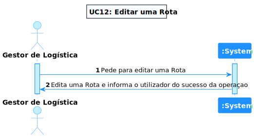
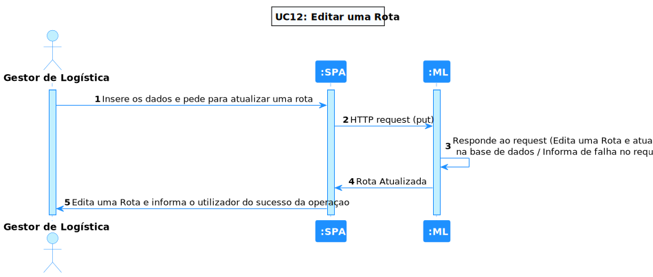
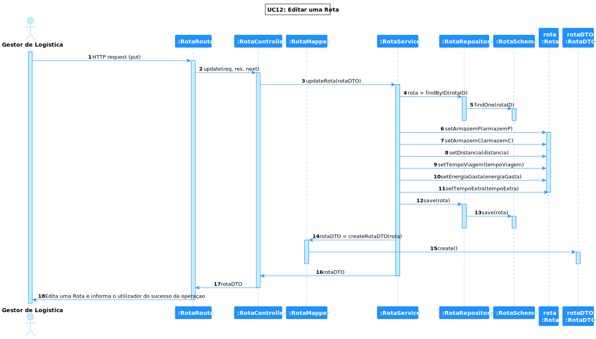

# UC 12 - Editar 'Rota'

## 1. Requirements Engineering

### 1.1. Descrição da Use Case

Editar 'Rota'.

### 1.2. Clarificações e especificações do cliente

* Pergunta: "Quanto ao UC:"Criar, Listar e Editar Percurso entre dois armazéns.", como é que é pretendido encontrar o percurso que deseja editar?Por algum dos seus dados?"
* [Resposta:](https://moodle.isep.ipp.pt/mod/forum/discuss.php?d=18960#p24140) "pelo armazem de origem e/ou de destino"

### 1.4. Dependências

É necessário existir, pelo menos, uma rota para conseguir dar update.

### 1.5 Input e Output

Input Data
  	
* json com os seguintes atributos :idArmazemPartida,idArmazemChegada,distancia,tempoViagemCheio,energiaGasta,tempoCarregamentoMáximo

Output Data

* a rota alterada

## 2. Vista de Processos

### 2.1. Nível 1

### 2.2. Nível 2

### 2.3. Nível 3

# 3. Observations
Esta Use Case é bastante simples de entender, porém, como o grupo não tem experiência na devida linguagem, o desenvolvimento foi mais demorado que o suposto, mas, apesar das dificuldades, foi possível concretizar a implementação e os respetivos testes.

