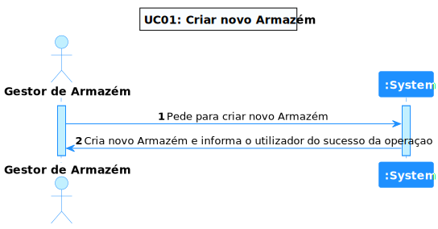
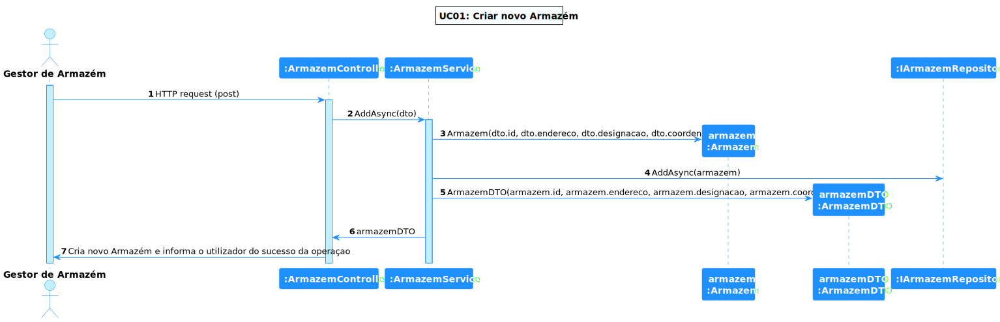

# **UC 13 - Criar um Armazém**

## **1. Requirements Engineering**

### **1.1. Descrição da Use Case**

*Criar um Armazém.*

### **1.2. Clarificações e especificações do cliente**

n/a

### **1.3. Dependências**

*Não existem dependências.*

### **1.4 Input e Output**

**Input Data**

* Id (providenciado pelo utilizador / 3 caracteres alfanumericos);
* Endereço:
  *  Morada;
  *  Código Postal (8 caracteres: 7 dígitos (4+3) separados por um hífen (-) e sem espaços);
  *  Localidade;
  *  País;
* Designacao (máximo de 50 caracteres);
* Coordenadas:
  * Latitude (entre -90 e 90);
  * Longitude (entre -180 e 180).

**Output Data**

* O Armazém criado

---

## **2. Vista de Processos**

### **2.1. Nível 1**

### **2.2. Nível 2**

### **2.3. Nível 3**

---

## **3. Observations**

### **3.1 Desenvolvimento**

**Dificuldades:** Apesar de este UC ser fácil após obter o conhecimento necessário para a desenvolver, houve uma dificuldade no que se toca a obter esse conhecimento durante o desenvolvimento, obrigando a retirar e gastar tempo resolvendo erros, pesquisando sobre possiveis soluções, etc. Desta maneira, certos requisitos mais pequenos foram, ás vezes, descartados, devido a não saber como a concretizar e aão ter o tempo necessário para descobrir, testar, falhar e re-iterar.

**Concretização:** Este UC ficou completamente concretizado, adicionando e tendo atenção ao detalhe, incluindo o aspeto do front-end para efetuar os requisitos e as devidas verificacões.

### **3.2 Testes**

Foram realizados diversos testes sobre os Armazéns, tais como:

* Testes End-To-End (e2e);
* Testes ao Componente;
* Testes ao Serviço.