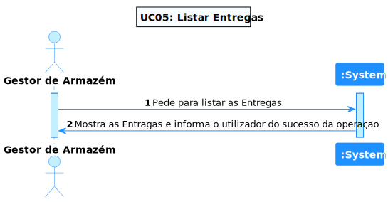

# UC 17 - Como gestor de armazéns pretendo listar Entregas.

## 1. Requirements Engineering

### 1.1. Descrição da Use Case

Como gestor de armazéns pretendo listar Entregas.

### 1.2. Clarificações e especificações do cliente

### 1.4. Dependências

### 1.5 Input e Output

* as entregas

## 2. Vista de Processos

### 2.1. Nível 1

### 2.2. Nível 2

### 2.3. Nível 3

# 3. Observations

*Esta US era bastante simples, o mais complicado foi a manipulação de html, pois foi a primeira vez do grupo a trabalhar com html.*

