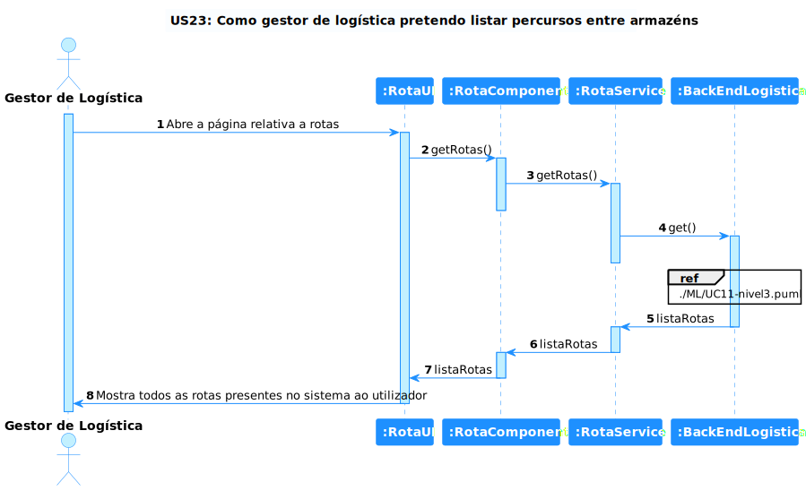

# US 23 - Como gestor de logística pretendo listar Percursos

## 1. Requirements Engineering

### 1.1. Descrição da Use Case

Como gestor de logística pretendo listar Percursos.

### 1.2. Clarificações e especificações do cliente

n/a

### 1.4. Dependências

n/a

### 1.5 Input e Output

n/a

## 2. Vista de Processos

### 2.1. Nível 1

### 2.2. Nível 2

### 2.3. Nível 3

# 3. Observations
Esta Use Case é simples de entender, o grupo como não está familiarizado com o desenvolvimento em fronted demorou mais do que o esperado mas os objetivos foram cumpridos quer em implementação quer em testes.