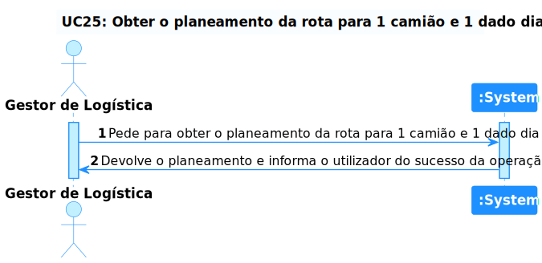
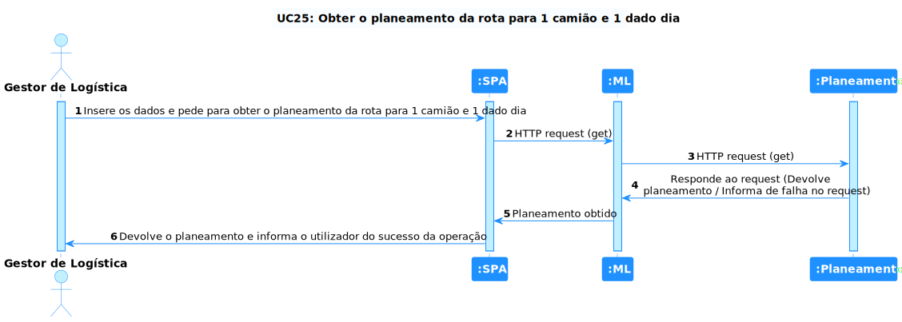

# US 25 - Como gestor de logística pretendo obter o Planeamento da rota para 1 camião e 1 dado dia

## 1. Requirements Engineering

### 1.1. Descrição da Use Case

Como gestor de logística pretendo obter o Planeamento da rota para 1 camião e 1 dado dia.

### 1.2. Clarificações e especificações do cliente

* Pergunta: "Quando refere visualizar o Planeamento isso significa conseguir ver os detalhes do planeamento obtido pelo Programa ou a visualização do percurso na Rede Viária? Se for a visualização de detalhes o pretendido quais seriam os detalhes mais relevantes?"
* [Resposta:](https://moodle.isep.ipp.pt/mod/forum/discuss.php?d=19573#p24853) "o gestor de logistica deve introduzir uma data e em seguida o sistema deve calcular a rota da frota de camiões para as entregas desse dia, sendo visualizado o resultado desse planeamento, ex:
camião
armazem destino A
entrega X
entrega Y
...
armazem destino B
entrega W"

* Pergunta: "Para obter o planeamento de 1 camião num dado dia, qual é a heuristica que se deve utilizar? Deve ser algo que o utilizador final pode escolher?"
* [Resposta:](https://moodle.isep.ipp.pt/mod/forum/discuss.php?d=19581#p24885) "se implementaram várias heuristicas, o utilizador deve poder escolher qual a heuristica a utilizar (ex., dropdown)"

* Pergunta: "Qual seria a métrica a avaliar para verificar a viabilidade do cálculo da solução, e qual seria o valor máximo da mesma?"
* [Resposta:](https://moodle.isep.ipp.pt/mod/forum/discuss.php?d=19444#p24687) "
A métrica tem a ver com o tempo para a geração da solução, ou seja, a partir de uma dada dimensão (nº de armazéns onde haverá entregas) a abordagem de tentar gerar a solução ótima (gerando todas e escolhendo a melhor) torna-se inviável pois o tempo de geração passa a ser muito elevado. "

### 1.4. Dependências

É necessário existir, um camião, uma entrega e um armazém no sistema para conseguir obter o planeamento.

### 1.5 Input e Output

Input Data
  	
* data

Output Data
  	
* planeamento

## 2. Vista de Processos

### 2.1. Nível 1

### 2.2. Nível 2

### 2.3. Nível 3 (SPA)

### 2.3. Nível 3 (Logistica)

# 3. Observations
* Esta US foi bastante complicada devido a que incluia a conexão de todos os módulos que criamos até agora para além do aprofundamento em prolog, que é uma linguagem que o grupo ainda não tem muita experiência. Apesar das complicações foi possível concluir esta User Story com todos os requerimentos.
