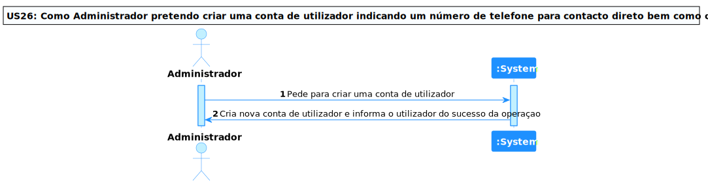
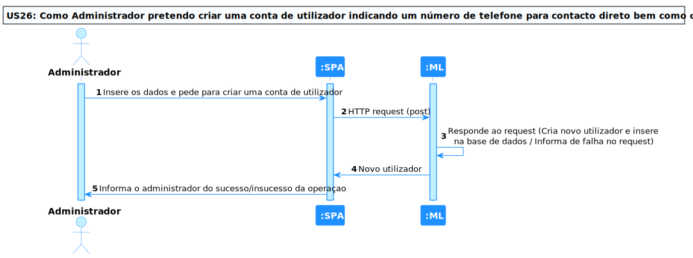
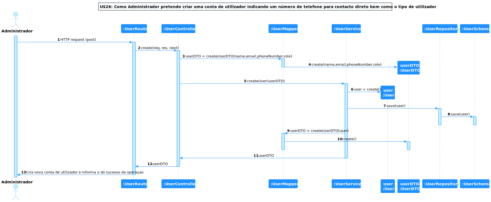

# US 26 - Como Administrador pretendo criar uma conta de utilizador indicando um número de telefone para contacto direto bem como o tipo de utilizador

## **1. Requirements Engineering**

### **1.1. Descrição da Use Case**

*Como Administrador pretendo criar uma conta de utilizador indicando um número de telefone para contacto direto bem como o tipo de utilizador*

### **1.2. Clarificações e especificações do cliente**

* Pergunta: "Quais os dados pessoais a serem inseridos aquando da criação de uma conta de utilizador? Basta o número de telefone ou teremos de introduzir mais dados?
No caso de serem necessários introduzir mais dados pessoais, de que forma é que os podemos obter? Por emails? Formulários?"
* [Resposta:](https://moodle.isep.ipp.pt/mod/forum/discuss.php?d=20079#p25502) "o administrador ao criar as contas de utilizador irá introduzir os dados pessoais do utilizador, nomeadamente o número de telefone de contacto. se acharem necessário recolher outros dados devem justifica-lo à luz do RGPD"

### **1.3. Dependências**

*É necessário dar login como administrador para criar uma conta de utilizador*

### **1.4 Input e Output**

**Input Data**

* email
* nome
* número de telémovel
* função

**Output Data**

* utilizador criado

---

## **2. Vista de Processos**

### **2.1. Nível 1**

### **2.2. Nível 2**

### **2.3. Nível 3**

---

## **3. Observações**

### **3.1 Desenvolvimento**

**Dificuldades:** Esta User Story foi bastante simples visto que o conceito era simples, porém, deu bastante trabalho, pois, foi necessário consultar o rgpd
para saber os atributos necessários para criar um cliente tal como criar uma UI para o administrador.

**Concretização:** Este US ficou completamente concretizada.

### **3.2 Testes**

Foram realizados diversos testes sobre a US, tais como:

* Testes ao Componente
* Testes ao Controller
* Testes ao Serviço(Front End e BackEnd)
* Testes End to End