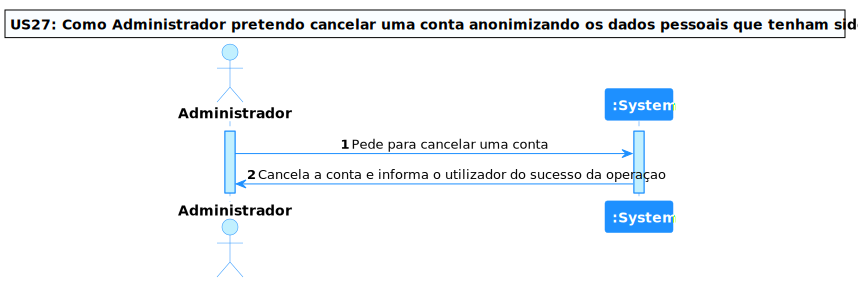
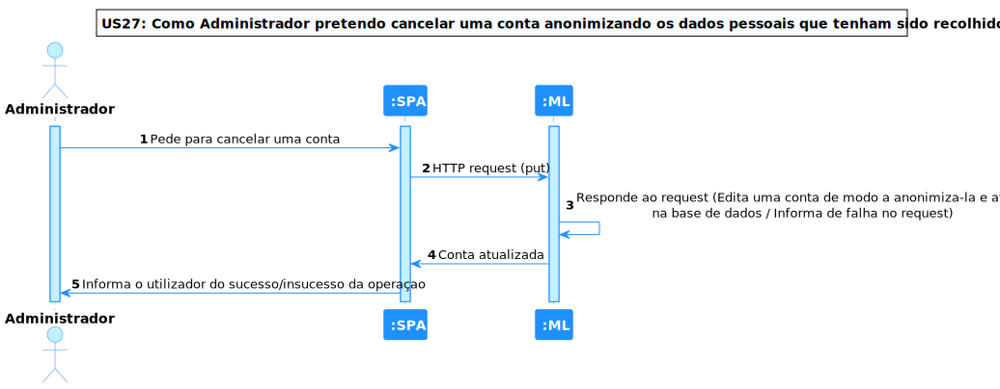
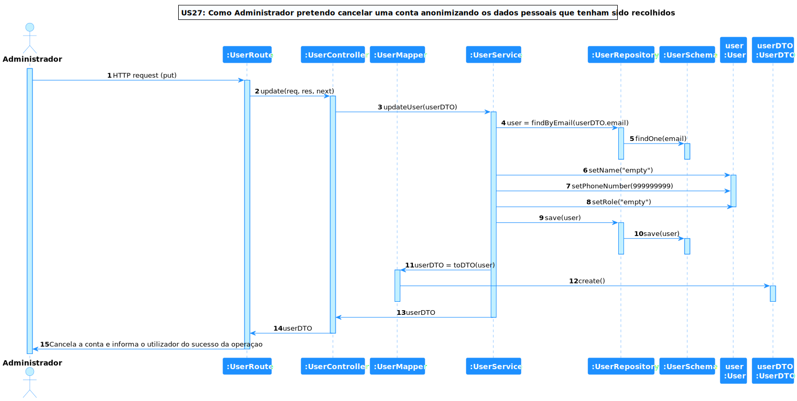

# US 27 - Como administrador pretendo cancelar uma conta anonimizando os dados pessoais que tenham sido recolhidos

## **1. Requirements Engineering**

### **1.1. Descrição da Use Case**

*Como administrador pretendo cancelar uma conta anonimizando os dados pessoais que tenham sido recolhidos*

### **1.2. Clarificações e especificações do cliente**

* Pergunta: "O uso da palavra "anonimizar" sugere que existirão dados que devem ser mantidos. Pode confirmar se, no contexto de negócio, pretende guardar outros dados (quais?) que não os identificadores do utilizador?"
* [Resposta:](https://moodle.isep.ipp.pt/mod/forum/discuss.php?d=20125#p25534) "os dados minimos da conta do utilizador são:
username,
nome completo e
número de telefone.
Para efeitos de integração com o mecanismo de SSO poderão necessitar de outros atributos
quando uma conta é cancelada deve manter-se a informação minima extremamente necessário e todos os restantes dados devem ser anonimizados. por exemplo, o número de telefone deixa de ser um dado necessário se a conta foi cancelada e como tal deve ser anonimizado (ex., 999999999) por forma a não ser possivel no futuro saber o número real de telefone desse utilizador cancelado"

* Pergunta: "I was wondering what is understood under the word "anonymizing" a user (if the translation is correct), does this means the data still has to exist (like id and role, but data like name and telnr should be erased), or does this mean we have to fully delete the user?"
* [Resposta:](https://moodle.isep.ipp.pt/mod/forum/discuss.php?d=20125#p25534) "In this case we need to keep the record that a user existed, but we need to make sure we don't keep the record of any personal data. for instance, if we previously stored the birthday of the user we should now replace it with a dummy date (e.g., 1/1/1111) or unset its value."

### **1.3. Dependências**

*É necessário existir uma conta para ser possível anonimiza-la.*

### **1.4 Input e Output**

n/a

---

## **2. Vista de Processos**

### **2.1. Nível 1**

### **2.2. Nível 2**

### **2.3. Nível 3**

---

## **3. Observações**

### **3.1 Desenvolvimento**

**Dificuldades:** Esta US foi bastante simples visto que apenas foi necessário dar update a certos valores.

**Concretização:** Este US ficou completamente concretizada.

### **3.2 Testes**

Foram realizados diversos testes sobre a US, tais como:

* Testes ao Componente
* Testes ao Controller
* Testes ao Serviço(Front End e BackEnd)
* Testes End to End