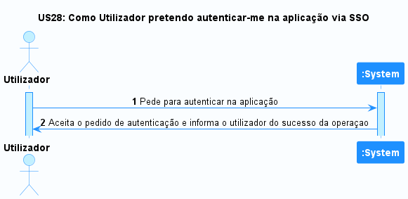
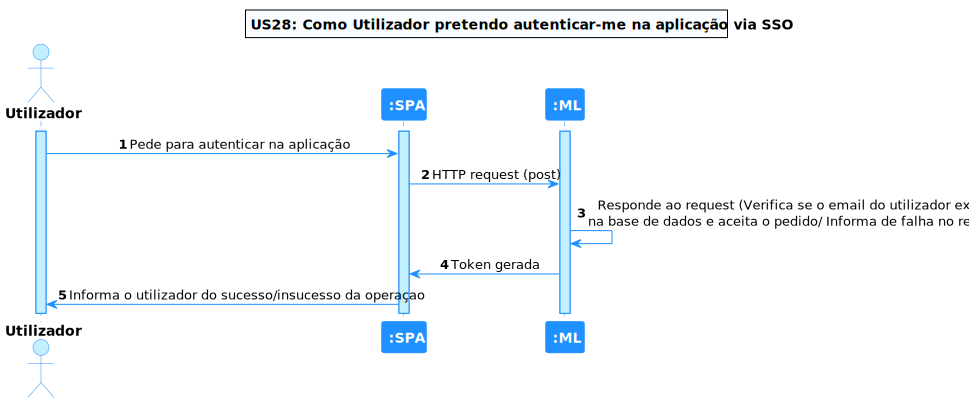
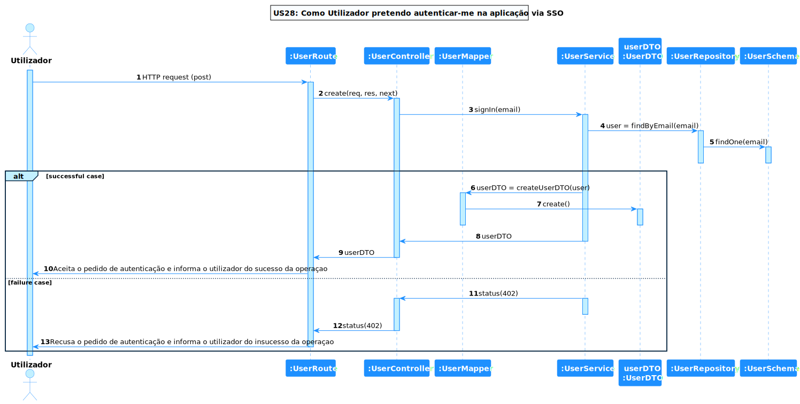
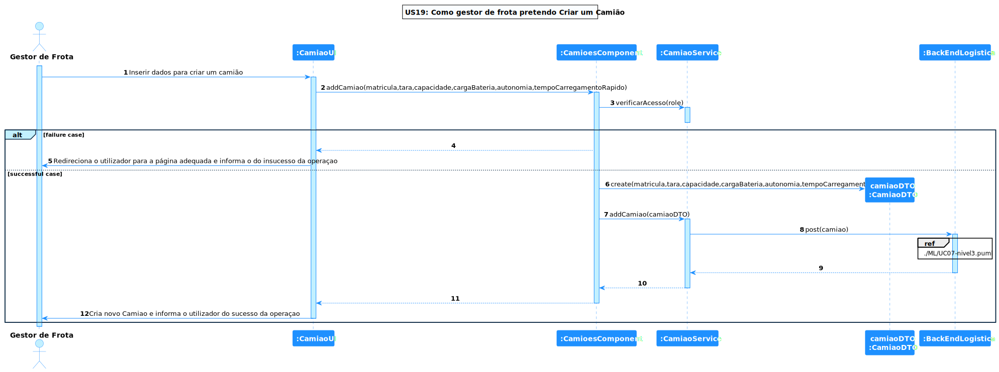
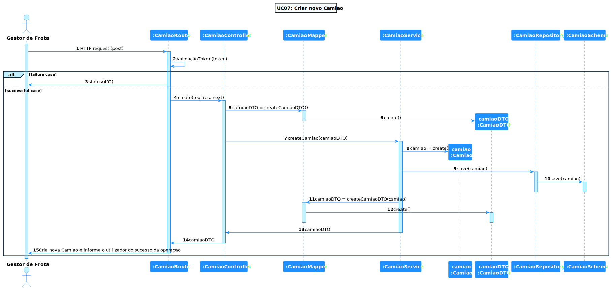
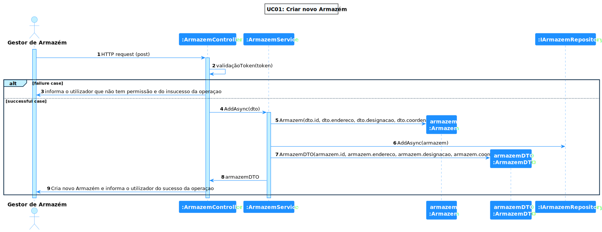

# US 28 - Como utilizador pretendo autenticar-me na aplicação via SSO (e.g. AzureAD, Google, Facebook)

## **1. Requirements Engineering**

### **1.1. Descrição da Use Case**

*Como utilizador pretendo autenticar-me na aplicação via SSO (e.g. AzureAD, Google, Facebook)*

### **1.2. Clarificações e especificações do cliente**

* Pergunta: "Após analisarmos o que é pretendido nesta funcionalidade ficamos na dúvida de quantos e quais provedores de identidade externas pretende ter disponível.
  É apenas o Azure AD? Apenas o Google? Uma combinação dos exemplos dados?"
* [Resposta:](https://moodle.isep.ipp.pt/mod/forum/discuss.php?d=19976#p25384) "basta um fornecedor. podem escolher livremente qual."

### **1.3. Dependências**

*É necessário que a conta do utilizador esteja criada para ser possível autenticar-se*

### **1.4 Input e Output**

**Input Data**

* Google Sign In

**Output Data**

* UI da role respetiva do utilizador

---

## **2. Vista de Processos**

### **2.1. Nível 1**

### **2.2. Nível 2**

### **2.3. Nível 3**

### **2.4. Validação de Tokens**

#### **SPA**

#### **ML**

#### **MGA**

---

## **3. Observações**

### **3.1 Desenvolvimento**

**Dificuldades:** Esta US foi complicada pois, devido ao SSO, foi necessário aprender como implementar a API do google na nossa aplicação e validar tokens de diversos módulos.

**Concretização:** Este US ficou completamente concretizadA.

### **3.2 Testes**

Foram realizados diversos testes sobre a US, tais como:

* Testes ao Componente
* Testes ao Controller
* Testes ao Serviço(Front End e BackEnd)
* Testes End to End