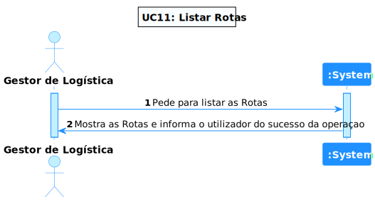
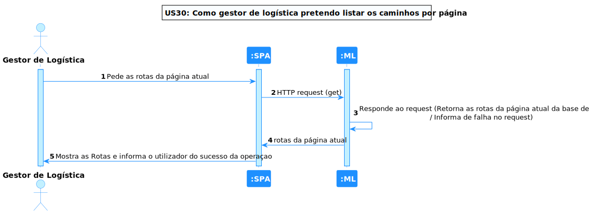
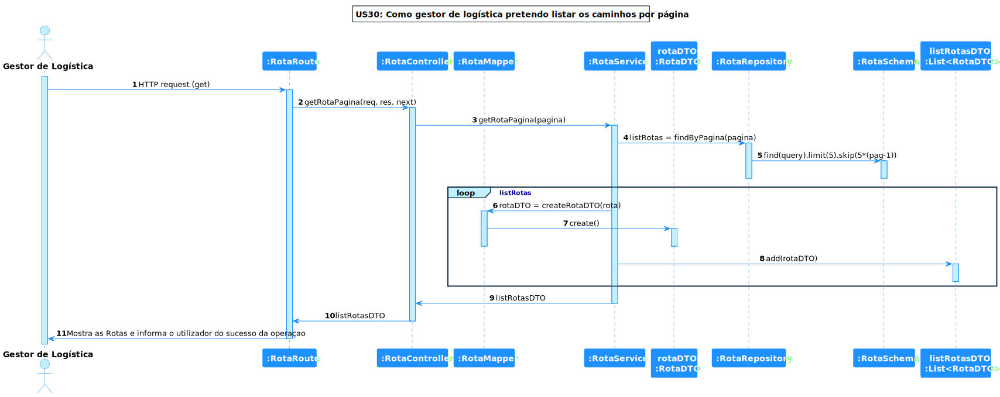

# US 30 - Como gestor de logística pretendo listar os caminhos por página

## **1. Requirements Engineering**

### **1.1. Descrição da Use Case**

*Como gestor de logística pretendo listar os caminhos por página*

### **1.2. Clarificações e especificações do cliente**

n/a

### **1.3. Dependências**

*Tem de existir rotas na base de dados*

### **1.4 Input e Output**

**Output Data**

* rotas

---

## **2. Vista de Processos**

### **2.1. Nível 1**

### **2.2. Nível 2**

### **2.3. Nível 3**

---

## **3. Observações**

### **3.1 Desenvolvimento**

**Dificuldades:** Nao existiram muitas dificuldades, pois esta US era bastante direta e simples

**Concretização:** Este US ficou completamente concretizada.

### **3.2 Testes**

Foram realizados diversos testes sobre a US, tais como:

* Testes ao Componente;
* Testes ao Serviço.