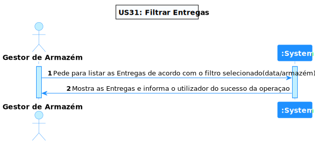
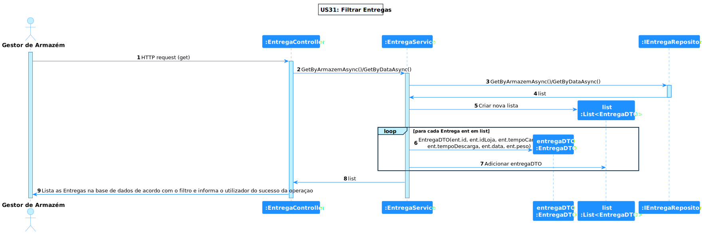
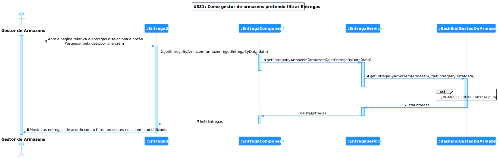

# US 31 - Como gestor de logística pretendo filtrar e ordenar as entregas pelas suas caraterísticas

## **1. Requirements Engineering**

### **1.1. Descrição da Use Case**

*Como gestor de logística pretendo filtrar e ordenar as entregas pelas suas caraterísticas*

### **1.2. Clarificações e especificações do cliente**

* Pergunta: "Quais as caraterísticas que pretende que sejam utilizadas para a filtragem, sendo que estas devem ser no formato ascendente, descendente ou ambas as opções sendo posteriormente uma escolha sua?"
* [Resposta:](https://moodle.isep.ipp.pt/mod/forum/discuss.php?d=20171#p25601) "os principais atributos a ordenar e filtrar são a data e o armazém de destino. a data deve ser ordenada por ordem cronologica inversa e o armazem ordenado de forma ascendente."

### **1.3. Dependências**

*É necessário existir entregas na base de dados*

### **1.4 Input e Output**

**Output Data**

* Entregas ordenadas

---

## **2. Vista de Processos**

### **2.1. Nível 1**

### **2.2. Nível 2**

### **2.3. Nível 3 (MGA)**

### **2.3. Nível 3 (SPA)**

---

## **3. Observações**

### **3.1 Desenvolvimento**

**Dificuldades:** Esta US foi bastante simples, visto que so foi necessário ordenar/filtrar uma lista existente

**Concretização:** Este US ficou completamente concretizadA.

### **3.2 Testes**

Foram realizados diversos testes sobre a US, tais como:

* Testes ao Componente;
* Testes ao Serviço.