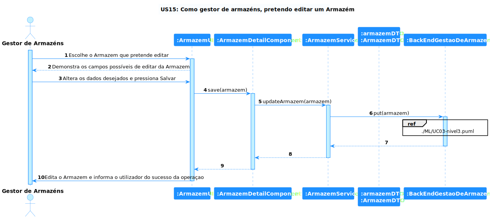

# US 32 - Como gestor de armazéns, pretendo inibir um armazém

## **1. Requirements Engineering**

### **1.1. Descrição da Use Case**

*Como gestor de armazéns, pretendo inibir um armazém*

### **1.2. Clarificações e especificações do cliente**

* Pergunta: "Depois de inibir o camião/armazém pretende que seja possível desinibi-lo??"
* [Resposta:](https://moodle.isep.ipp.pt/mod/forum/discuss.php?d=20021#p25421) "sim, deve ser possivel desinibir, mas é aceitavel que essa user story tenha menor prioridade que as restantes do caderno de encargos para este sprint."

### **1.3. Dependências**

*É necessário existire, pelo menos, um armazém criado*

### **1.4 Input e Output**

**Input Data**

* dados que deseja atualizar

**Output Data**

* armazém atualizado

---

## **2. Vista de Processos**

### **2.1. Nível 1**

### **2.2. Nível 2**

### **2.3. Nível 3**

#### MGA ####

#### SPA ####

---

## **3. Observações**

### **3.1 Desenvolvimento**

**Dificuldades:** Esta User Story foi bastante simples visto que a fundação ja estava feita, so foi necessário adicionar um atributo ao armazém

**Concretização:** Esta US ficou completamente concretizada.

### **3.2 Testes**

Foram atualizados os testes anteriores sobre a US.
