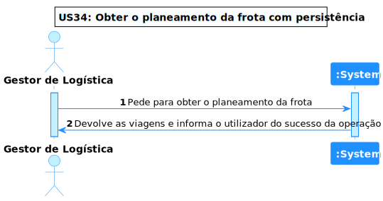

# US 34 - Planeamento de frota com persistência da solução (viagens)

## **1. Requirements Engineering**

### **1.1. Descrição da Use Case**

*Planeamento de frota com persistência da solução (viagens)*

### **1.2. Clarificações e especificações do cliente**

* Pergunta: "Na US da persistência da solução (Viagem) é pretendido que seja persistido mais do que uma solução para um camião em um dado dia? Por exemplo uma solução com o algoritmo findall outra com o algoritmo de Heuristica do maior peso etc.."
* [Resposta:](https://moodle.isep.ipp.pt/mod/forum/discuss.php?d=19994#p25386) "deve ser efetuada a persistência de cada solução que seja mostrada ao utilizador"

### **1.3. Dependências**

*É necessário existir entregas para planear uma viagem*

### **1.4 Input e Output**

**Input Data**

* Data
* Número de gerações
* Dimensão da população
* Probabilidade de cruzamento
* Probabilidade de mutação
* Tempo mínimo aceitável

**Output Data**

* Viagem criada

---

## **2. Vista de Processos**

### **2.1. Nível 1**

### **2.2. Nível 2**

### **2.3. Nível 3 (ML)**

### **2.3. Nível 3 (SPA)**

---

## **3. Observações**

### **3.1 Desenvolvimento**

**Dificuldades:** Esta US foi complicada devido ao facto de ter envolvido diversos módulos e ser dificil de testar

**Concretização:** Este US ficou completamente concretizada.

### **3.2 Testes**

Foram realizados diversos testes sobre a US, tais como:

* Testes ao Componente
* Testes ao Controller
* Testes ao Serviço(Front End e BackEnd)
* Testes End to End