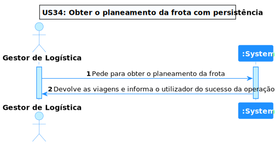
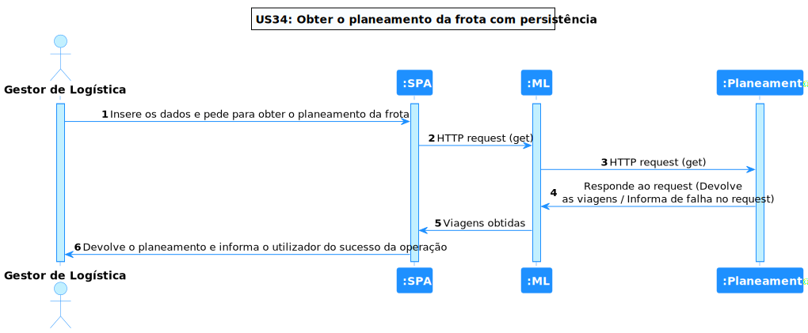
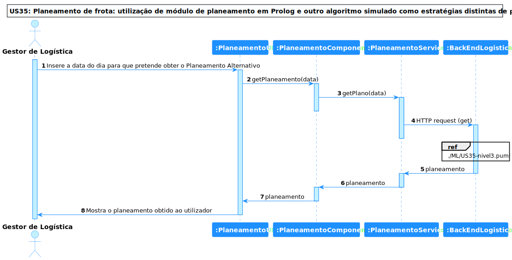
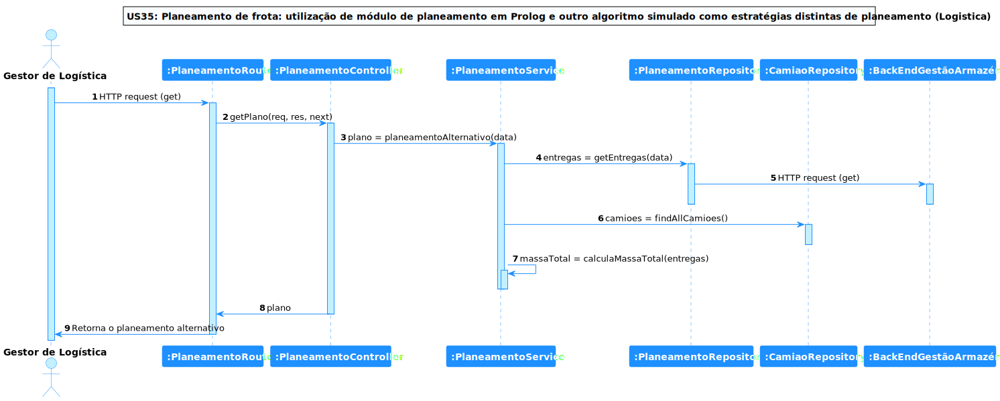

# US 35 - Planeamento de frota: utilização de módulo de planeamento em Prolog e outro algoritmo simulado como estratégias distintas de planeamento

## **1. Requirements Engineering**

### **1.1. Descrição da Use Case**

*Planeamento de frota: utilização de módulo de planeamento em Prolog e outro algoritmo simulado como estratégias distintas de planeamento*

### **1.2. Clarificações e especificações do cliente**

* Pergunta: "O "algoritmo simulado" devera retornar o mesmo planemaneto independete do input do utilizador mas pode esclarecer o que este planemento "estatico" devera ser? É um planeamento por exemplo baseado em algumas informações presentes na base de dados  ou um planeamento estritamente defenido por nós?"
* [Resposta:](https://moodle.isep.ipp.pt/mod/forum/discuss.php?d=20229#p25678) "trata-se de um algoritmo simulado. podem optar por devolver sempre os mesmos dados "hard coded" ou ajustar ligeiramente o output tendo em conta o input (data de planeamento) e os dados da BD (ex., camiões que existam e entregas que existam) mas sem se preocuparem com o "planeamento otimizado" da frota para esse dia"

* Pergunta: "m relação à US de ARQSI 3.3.2 - 1.b "Planeamento de frota: utilização de módulo de planeamento em Prolog e outro algoritmo simulado como estratégias distintas de planeamento", gostaríamos de confirmar o que é que entende por "outro algoritmo simulado como estratégias distintas de planeamento"?"
* [Resposta:](https://moodle.isep.ipp.pt/mod/forum/discuss.php?d=20018#p25420) "este requisito pretende acima de tudo que a solução seja flexivelk para no futuro poder substituir o módulo de planeamento por outro. nesse sentido o "algoritmo simulado" é um módulo de planeamento mas no qual o algoritmo utilizado não é funcional. por exemplo, retorna sempre o mesmo planeamento independentemente dos dados de input utilizados"

### **1.3. Dependências**

Para que esta user story seja corretamente realizada deve existir pelo menos 1 camião e 1 entrega.

### **1.4 Input e Output**

**Input Data**

* data

**Output Data**

* camiões, respetivos caminhos e entregas

---

## **2. Vista de Processos**

### **2.1. Nível 1**

### **2.2. Nível 2**

### **2.3. Nível 3 (SPA)**

### 2.3. Nível 3 (Logistica)

---

## **3. Observações**

### **3.1 Desenvolvimento**

**Dificuldades:** Intermédia

**Concretização:** Este UC ficou completamente concretizado.

### **3.2 Testes**

Foram realizados diversos testes sobre a US, tais como:

* Testes ao Componente;
* Testes ao Serviço.