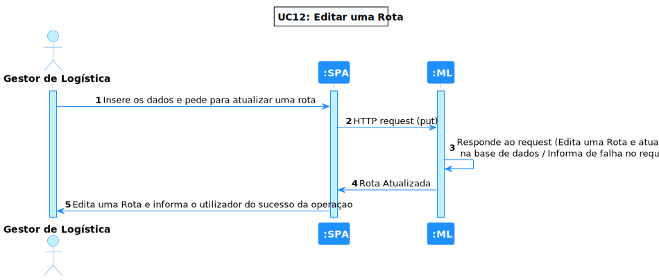
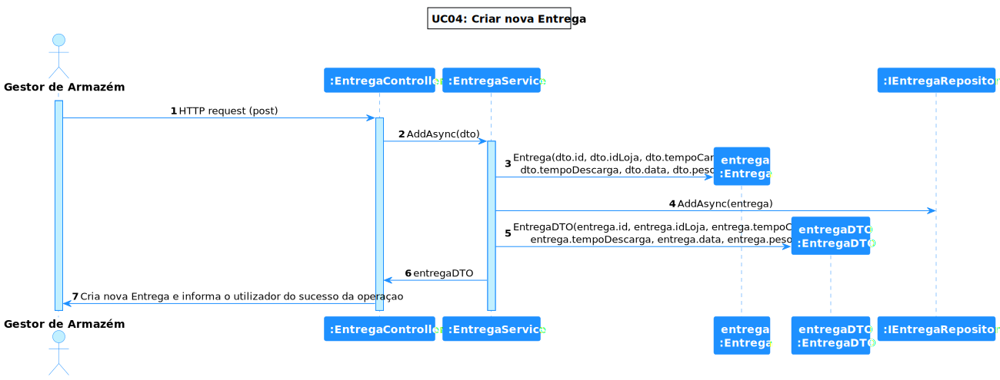
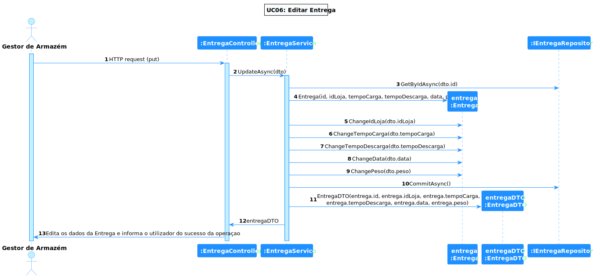
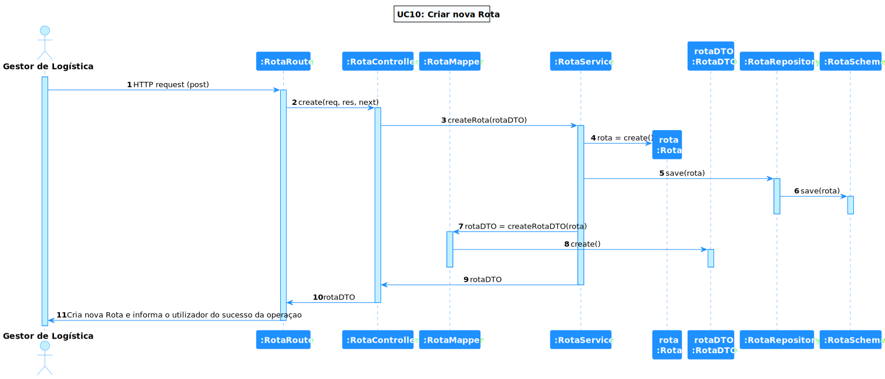
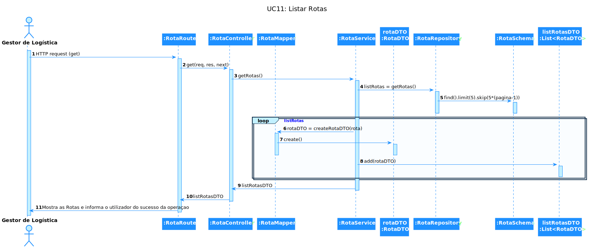
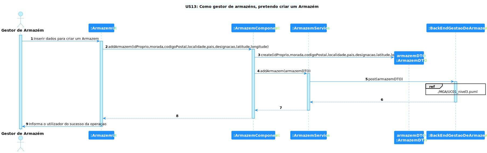
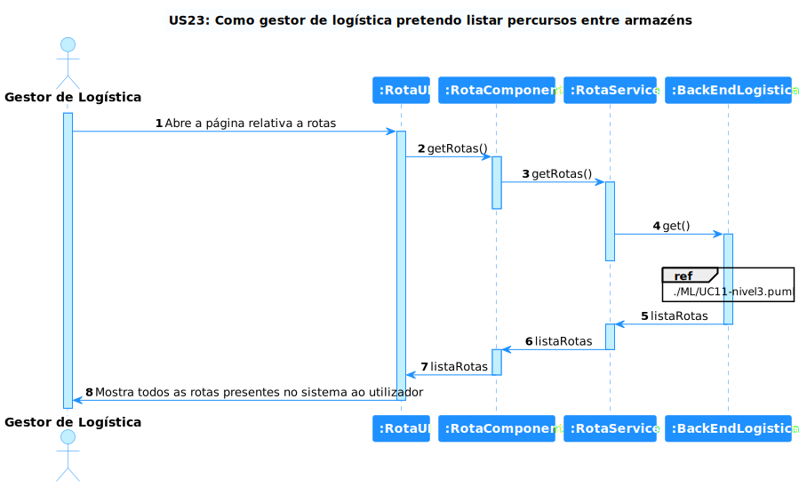

# Views

## Introduction
Será adotada a combinação de dois modelos de representação arquitetural: C4 e 4+1.

O Modelo de Vistas 4+1 [[Krutchen-1995]](References.md#Kruchten-1995) propõe a descrição do sistema através de vistas complementares permitindo assim analisar separadamente os requisitos dos vários stakeholders do software, tais como utilizadores, administradores de sistemas, project managers, arquitetos e programadores. As vistas são deste modo definidas da seguinte forma:

- Vista lógica: relativa aos aspetos do software visando responder aos desafios do negócio;
- Vista de processos: relativa ao fluxo de processos ou interações no sistema;
- Vista de desenvolvimento: relativa à organização do software no seu ambiente de desenvolvimento;
- Vista física: relativa ao mapeamento dos vários componentes do software em hardware, i.e. onde é executado o software;
- Vista de cenários: relativa à associação de processos de negócio com atores capazes de os espoletar.

O Modelo C4 [[Brown-2020]](References.md#Brown-2020)[[C4-2020]](References.md#C4-2020) defende a descrição do software através de quatro níveis de abstração: sistema, contentor, componente e código. Cada nível adota uma granularidade mais fina que o nível que o antecede, dando assim acesso a mais detalhe de uma parte mais pequena do sistema. Estes níveis podem ser equiparáveis a mapas, e.g. a vista de sistema corresponde ao globo, a vista de contentor corresponde ao mapa de cada continente, a vista de componentes ao mapa de cada país e a vista de código ao mapa de estradas e bairros de cada cidade.
Diferentes níveis permitem contar histórias diferentes a audiências distintas.

Os níveis encontram-se definidos da seguinte forma:
- Nível 1: Descrição (enquadramento) do sistema como um todo;
- Nível 2: Descrição de contentores do sistema;
- Nível 3: Descrição de componentes dos contentores;
- Nível 4: Descrição do código ou partes mais pequenas dos componentes (e como tal, não será abordado neste DAS/SAD).

Pode-se dizer que estes dois modelos se expandem ao longo de eixos distintos, sendo que o Modelo C4 apresenta o sistema com diferentes níveis de detalhe e o Modelo de Vista 4+1 apresenta o sistema de diferentes perspetivas. Ao combinar os dois modelos torna-se possível representar o sistema de diversas perspetivas, cada uma com vários níveis de detalhe.

Para modelar/representar visualmente, tanto o que foi implementado como as ideias e alternativas consideradas, recorre-se à Unified Modeling Language (UML) [[UML-2020]](References.md#UML-2020) [[UMLDiagrams-2020]](References.md#UMLDiagrams-2020).

## Nível 1
### Vista Lógica

### Vista de Processos
#### SSD UC1

#### SSD UC2

#### SSD UC3

#### SSD UC4

#### SSD UC5

#### SSD UC6

#### SSD UC7

#### SSD UC8

#### SSD UC9

#### SSD UC10

#### SSD UC11

#### SSD UC12

## Nível 2
### Vista Lógica

### Vista de Processos

#### SSD UC1

#### SSD UC2

#### SSD UC3

#### SSD UC4

#### SSD UC5

#### SSD UC6

#### SSD UC7

#### SSD UC8

#### SSD UC9

#### SSD UC10

#### SSD UC11

#### SSD UC12

### Vista de Implementação

### Vista Física

## Nível 3
### Vista Lógica (ML)

### Vista Lógica (MGA)

### Vista de Implementação(ML/MGA)

### Vista Lógica (SPA)

### Vista de Implementação(SPA)

### Vista de Processos

#### SD UC1

#### SD UC2

#### SD UC3

#### SD UC4

#### SD UC5

#### SD UC6

#### SD UC7

#### SD UC8

#### SD UC9

#### SD UC10

#### SD UC11

#### SD UC12

#### SD US13

#### SD US14

#### SD US15

#### SD US16

#### SD US17

#### SD US18

#### SD US19

#### SD US20

#### SD US21

#### SD US22

#### SD US23

#### SD US24

#### SD US25(SPA)

#### SD US25(Logistica)

